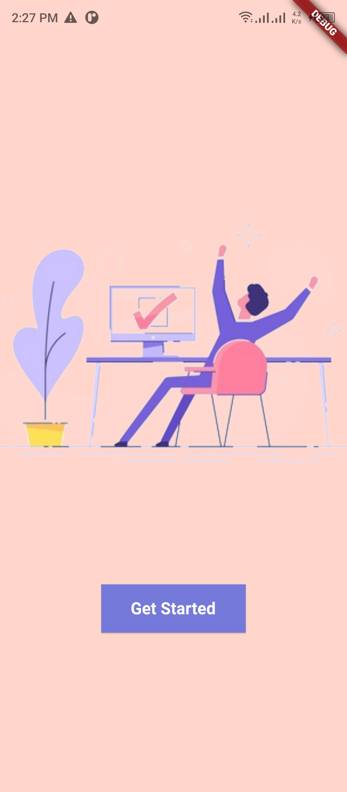
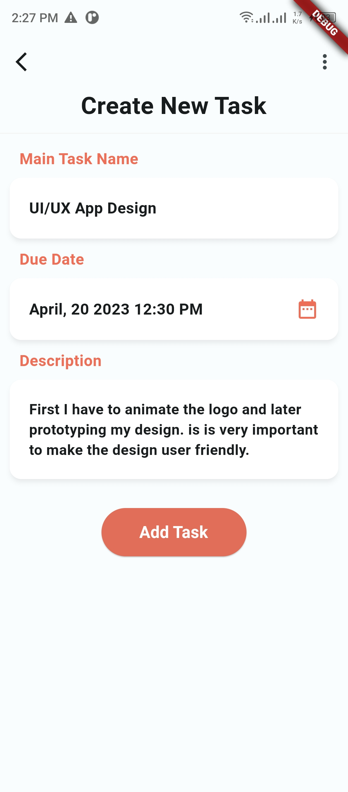

# Add Task 

## Description

This repository contains a Flutter application that implements a Todo List App User interface based on Figma File Provided (https://www.figma.com/file/oMCL0SuMcmKi9YgcDTwMLR/Untitled?type=design&node-id=0%3A1&mode=design&t=Pb02wuayx0owt68D-1).

## Screenshot Demo

