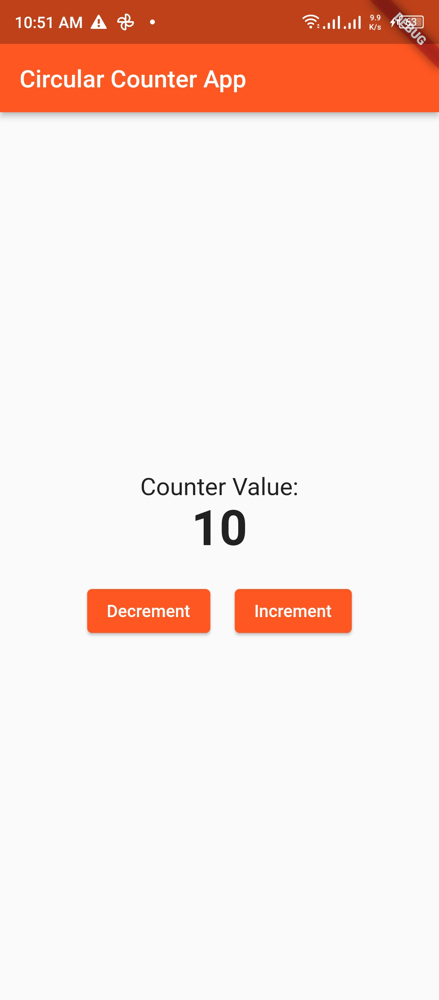

# circular_counter

## Description

This repository contains a Flutter application that implements a circular counter with a value between 0 and 10. The counter loops back to 0 when it exceeds 10 and loops back to 10 when it goes below 0. The application includes a simple user interface with a centered text displaying the counter value and two buttons, one for incrementing the counter and the other for decrementing it.

## Video Demo

Click on the thumbnail below to watch the video demo:

