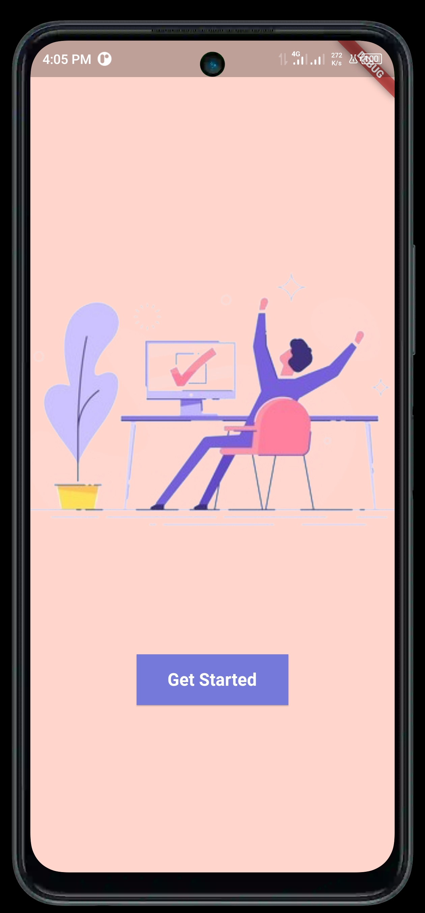
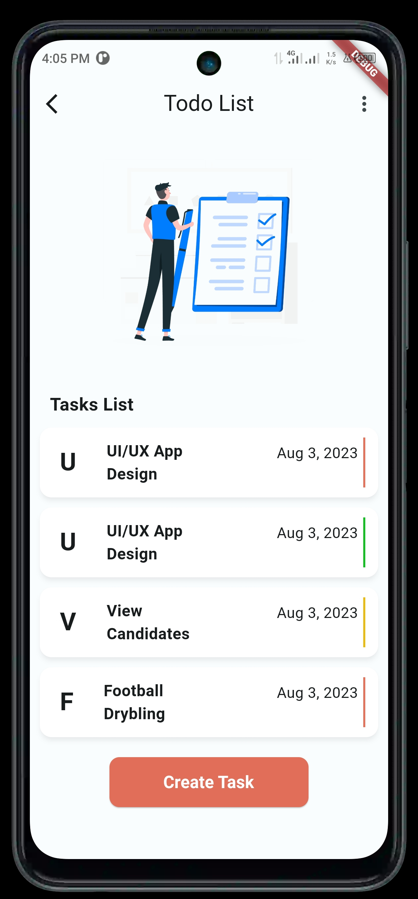
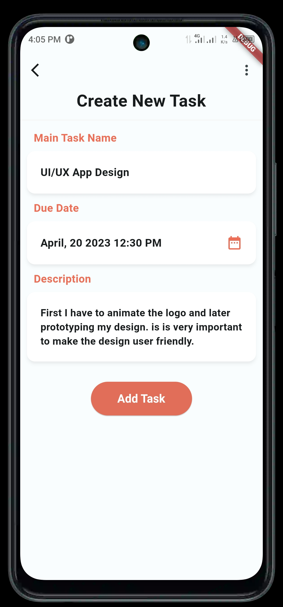
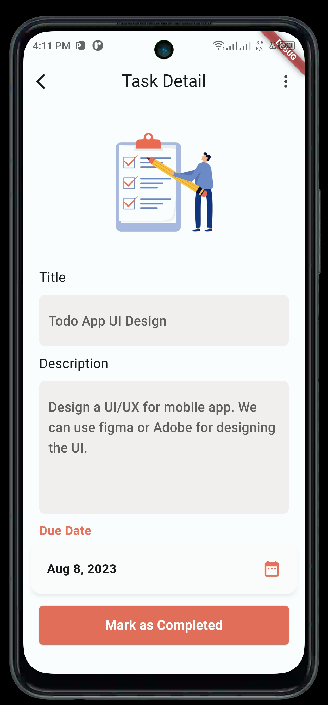
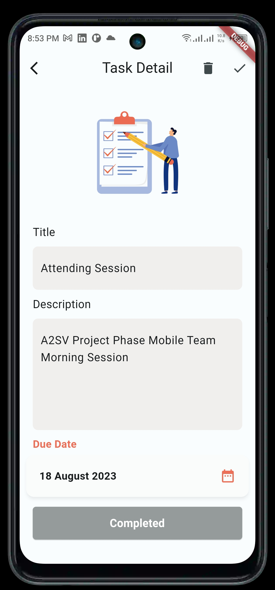
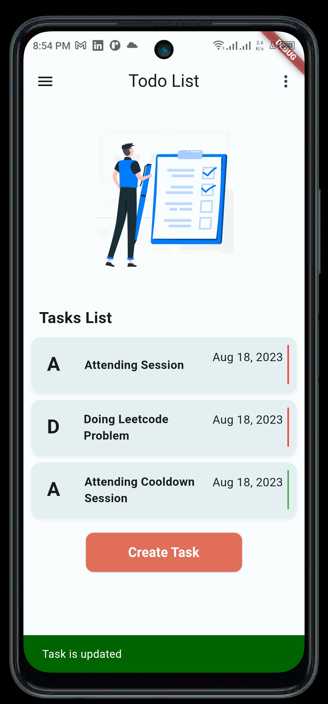
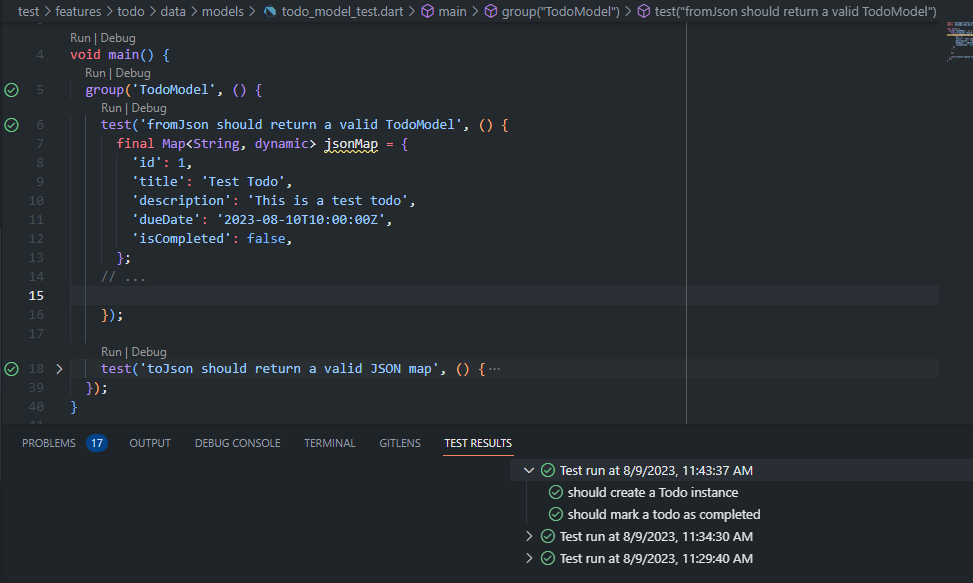

## Description
A2SV 2023 project phase Mobile Team,This repository serves as a central hub for tracking the progress of my app development tasks.

## Screenshot Demo

<div style="display: flex; flex-direction: row;">
  
  
  
  
  
  
  
</div>

 
## Features Added Yet:
- Task List
- Adding Task
- Editing Task
- Marking Task as Completed
- Deleting Task 

## Updates

### Aug 18, 2023 Task 1

- Consume Bloc for Task Management
  ```dart
  class TodoBloc extends Bloc<TodoEvent, TodoState> {
    final GetAllTask getAllTasks;
    final GetSingleTask getSingleTask;
    final UpdateTask updateTask;
    final DeleteTask deleteTask;

    TodoBloc({
      required this.getAllTasks,
      required this.getSingleTask,
      required this.updateTask,
      required this.deleteTask,
    }) : super(InitialState()) {
      on<LoadAllTasksEvent>((event, emit) async {
        emit(LoadingState());
        final Either<Failure, List<Todo>> result = await getAllTasks(NoParams());
        emit(result.fold(
          (failure) => ErrorState(_mapFailureToMessage(failure)),
          (tasks) => LoadedAllTasksState(tasks),
        ));
      });

      on<GetSingleTaskEvent>((event, emit) async {
        emit(LoadingState());
        final Either<Failure, Todo> result = await getSingleTask(event.taskId);
        emit(result.fold(
          (failure) => ErrorState(_mapFailureToMessage(failure)),
          (task) => LoadedSingleTaskState(task),
        ));
      });
      on<UpdateTaskEvent>((event, emit) async {
        emit(LoadingState());
        final updatedTask = Todo(
          id: event.taskId,
          title: event.updatedTitle,
          description: event.updatedDescription,
          dueDate: event.updatedDueDate,
          isCompleted: true, // Mark task as completed
        );

        final Either<Failure, Todo> result =
            await updateTask(UpdateTaskParams(task: updatedTask));
        emit(result.fold(
          (failure) => ErrorState(_mapFailureToMessage(failure)),
          (task) => LoadedSingleTaskState(task),
        ));
      });

      on<DeleteTaskEvent>((event, emit) async {
        emit(LoadingState());
        final result = await deleteTask(event.taskId);
        result.fold(
          (failure) => emit(ErrorState(_mapFailureToMessage(failure))),
          (_) => emit(
              DeletedTaskState()), // You might want to define a DeletedTaskState
        );
      });
    }

    String _mapFailureToMessage(Failure failure) {
      return 'An error occurred';
    }
  }

### Aug 16, 2023 Task 1
- Create Event Classes, Create the necessary Event classes for your Todo app. 
  ```dart
  part of 'todo_bloc.dart';

  sealed class TodoEvent extends Equatable {
    const TodoEvent();

    @override
    List<Object> get props => [];
  }

  class LoadAllTasksEvent extends TodoEvent {}

  class GetSingleTaskEvent extends TodoEvent {
    final int taskId;

    const GetSingleTaskEvent(this.taskId);

    @override
    List<Object> get props => [taskId];
  }

  class UpdateTaskEvent extends TodoEvent {
    final int taskId;
    final String updatedTitle;
    final String updatedDescription;
    final DateTime updatedDueDate;

    const UpdateTaskEvent({
      required this.taskId,
      required this.updatedTitle,
      required this.updatedDescription,
      required this.updatedDueDate,
    });

    @override
    List<Object> get props =>
        [taskId, updatedTitle, updatedDescription, updatedDueDate];
  }

  class DeleteTaskEvent extends TodoEvent {
    final int taskId;

    const DeleteTaskEvent(this.taskId);

    @override
    List<Object> get props => [taskId];
  }

  class CreateTaskEvent extends TodoEvent {
    final String title;
    final String description;
    final DateTime dueDate;

    const CreateTaskEvent({
      required this.title,
      required this.description,
      required this.dueDate,
    });

    @override
    List<Object> get props => [title, description, dueDate];
  }

### Aug 11, 2023 Task 1
- Local Data Source in Flutter Clean Architecture:
Note: Caching data gotten from the remote API. We're going to implement it using shared_preferences.
  ```dart
  class TodoLocalDataSource implements TodoDataSource {
  final SharedPreferences sharedPreferences;

  TodoLocalDataSource(this.sharedPreferences);

  @override
  Future<List<Todo>> getAllTodos() async {
    final jsonString = sharedPreferences.getString('todos');
    if (jsonString != null) {
      final List<dynamic> todoListJson = json.decode(jsonString);
      final todos = todoListJson.map((json) => Todo.fromJson(json)).toList();
      return todos;
    } else {
      return [];
    }
  }

  @override
  Future<Todo> createTodo(Todo todo) async {
    final todos = await getAllTodos();
    todos.add(todo);
    await saveTodos(todos);
    return todo;
  }
### Aug 10, 2023 Task 2
- Notwork Information Checker:
  ```dart
  //  lib/core/platform/newtwork_info.dart
  import 'package:internet_connection_checker/internet_connection_checker.dart';
  abstract class NetworkInfo {
    Future<bool> get isConnected;
  }

  class NetworkInfoImpl implements NetworkInfo {
    final InternetConnectionChecker connectionChecker;

    NetworkInfoImpl(this.connectionChecker);

    @override
    Future<bool> get isConnected => connectionChecker.hasConnection;
  }

### Aug 10, 2023 Task 1
- Contract and Repository::
  ```dart
  class TodoRepositoryImpl implements TodoRepository {
    final TodoLocalDataSource localDataSource;

    TodoRepositoryImpl(this.localDataSource);

    @override
    Future<Either<Failure, List<Todo>>> getAllTodos() async {
      try {
        final todos = await localDataSource.getAllTodos();
        return Right(todos);
      } catch (e) {
        return const Left(ServerFailure("Failed to get all todos"));
      }
    }

    @override
    Future<Either<Failure, Todo>> createTodo(Todo todo) async {
      try {
        final createdTodo = await localDataSource.createTodo(todo);
        return Right(createdTodo);
      } catch (e) {
        return const Left(ServerFailure("Failed to create todo"));
      }
    }

    @override
    Future<Either<Failure, Todo>> updateTodo(Todo todo) async {
      try {
        final updatedTodo = await localDataSource.updateTodo(todo);
        return Right(updatedTodo);
      } catch (e) {
        return const Left(ServerFailure("Failed to update todo"));
      }
    }

    @override
    Future<Either<Failure, bool>> markTodoAsCompleted(int todoId) async {
      try {
        final success = await localDataSource.markTodoAsCompleted(todoId);
        return Right(success);
      } catch (e) {
        return const Left(ServerFailure("Failed to mark todo as completed"));
      }
    }
  }

### Aug 9, 2023 Task 2
- Implementation of a contract defining repository methods:
  ```dart
  // lib/feature/data/repositories/todo_repository_impl.dart
  class TodoRepositoryImpl implements TodoRepository {
    @override
    Future<Either<Failure, List<Todo>>> getAllTodos() async {
      // TODO: Implement getAllTodos

      return const Right([]);
    }

    Future<List<Todo>> fetchDataFromDataSource() async {
      // TODO: Implement data retrieval logic here For example, fetch data from a database or an API

      return []; // Replace with actual data
    }
  }

- Interfaces or abstract classes for repository dependencies:
  ```dart

  abstract class TodoRepository {
    Future<Either<Failure, List<Todo>>> getAllTodos();
  } 

- Basic structure of the repository:
  ```dart
  // lib/feature/data/datasource/todo_remote_data_source.dart
  class TodoRemoteDataSource implements TodoDataSource {

    @override
    Future<List<Todo>> getAllTodos() async {
      // TODO: Replace with actual API calls and data parsing
      return [];
    }
  } 
  
- Integration of a 3rd party package for network connectivity:
  ```dart
  //  lib/core/platform/newtwork_info.dart
  import 'package:internet_connection_checker/internet_connection_checker.dart';
  abstract class NetworkInfo {
    Future<bool> get isConnected;
  }

  class NetworkInfoImpl implements NetworkInfo {
    final InternetConnectionChecker connectionChecker;

    NetworkInfoImpl(this.connectionChecker);

    @override
    Future<bool> get isConnected => connectionChecker.hasConnection;
  }


### Aug 9, 2023 Task 1
- Organize the project structure according to Clean Architecture principles: </br>
  ✅ Project Structure is Organized

- Define Entities inside core:
  ```dart
  // lib/core/entities/todo.dart
  class Todo {
    final int id;
    final String title;
    final String description;
    final DateTime dueDate;
    final bool isCompleted;

    Todo({
      required this.id,
      required this.title,
      required this.description,
      required this.dueDate,
      this.isCompleted = false,
    }); 
    //  
    }

- Implement Use Cases inside core:
  ```dart
  // lib/core/usecases/get_todos_usecase.dart
  class GetTodosUseCase
      implements UseCase<Either<Failure, List<Todo>>, NoParams> {
    late final TodoRepository repository;

    GetTodosUseCase(this.repository); // Pass the repository through constructor

    @override
    Future<Either<Failure, List<Todo>>> call(NoParams params) async {
      // Implementing the logic to fetch todos from the repository or data source
      try {
        final todos = await repository.getAllTodos();
        return Right(todos as List<Todo>);
      } catch (e) {
        return Left(Failure("Failed to fetch todos"));
      }
    }
  }

- Implement Models and include conversion logic to and from JSON:
  ```dart
  // lib/features/todo/data/models/todo.dart
  import 'package:todo_main_app/core/entities/todo.dart';
  class TodoModel {
    final int id;
    final String title;
    final String description;
    final DateTime dueDate;
    final bool isCompleted;

    TodoModel({
      required this.id,
      required this.title,
      required this.description,
      required this.dueDate,
      required this.isCompleted,
    });

    factory TodoModel.fromJson(Map<String, dynamic> json) {
      return TodoModel(
        id: json['id'],
        title: json['title'],
        description: json['description'],
        dueDate: DateTime.parse(json['dueDate']),
        isCompleted: json['isCompleted'],
      );
    }

    Map<String, dynamic> toJson() {
      return {
        'id': id,
        'title': title,
        'description': description,
        'dueDate': dueDate.toIso8601String(),
        'isCompleted': isCompleted,
      };
    }
  }

- Test coverage: Comprehensive unit tests, widget tests to ensure correctness, and error-free execution:</br></br>
  


### Aug 8, 2023 Task 2
<details>
  <summary>Click To Expand </summary>

- Create an entity class named Task:
  ```dart
  class Task extends Equatable {
  final int id;
  final String title;
  final String description;
  final DateTime dueDate;
  final bool isCompleted;
  // .....
  }
-  Implement the following use cases using callable classes:
- ViewAllTasks
  ```dart
  class ViewAllTasksUsecase implements UseCase<List<Task>, NoParams> {
    final TaskRepository repository;

    ViewAllTasksUsecase(this.repository);

    @override
    Future<List<Task>> call(NoParams params) async {
      return await repository.getAllTasks();
    }
  }

- ViewTask
  ```dart
  class ViewTaskUsecase implements UseCase<Task, int> {
    final TaskRepository repository;

    ViewTaskUsecase(this.repository);

    @override
    Future<Task> call(int taskId) async {
      return await repository.getTaskById(taskId);
    }
  }

- CreateTask
  ```dart
  class CreateTaskUsecase implements UseCase<void, Task> {
  final TaskRepository repository;

  CreateTaskUsecase(this.repository);

  @override
  Future<void> call(Task newTask) async {
    await repository.createTask(newTask);
  }
  }

</details>

### Aug 8, 2023 Task 1
<details>
  <summary>Click To Expand </summary>

- Set Due Date Feature:
  ```dart
  Row(
    children: <Widget>[
      Expanded(
        child: Text(
          DateFormat('MMM d, yyyy').format(selectedDate),
          style: const TextStyle(
            fontSize: 16,
            fontWeight: FontWeight.bold,
          ),
        ),
      ),
      // Other OnTab implementaion check on file
    ],
  ),

- Mark Task as Completed Feature:
  ```dart
  ElevatedButton(
      onPressed: () async {
        await viewTaskUsecase.updateTaskCompletionStatus(task.id, true);
        Navigator.pop(context); // Navigate back to the previous screen
      },
      style: ElevatedButton.styleFrom(
        backgroundColor: const Color.fromRGBO(238, 111, 87, 1),
        minimumSize: const Size(150, 50),
        shape: RoundedRectangleBorder(
          borderRadius: BorderRadius.circular(5),
        ),
      ),
      child: const Text(
        'Mark as Completed')

- Clean Architecture and TDD:</br>
  ✅ I had successfully organized my folder structure with Flutter Clean Architecture

- Error Handling and Either Type:
  ```dart
    class ViewAllTasksUsecase
      implements UseCase<Either<Failure, List<Task>>, NoParams> {
    final TaskRepository repository;

    ViewAllTasksUsecase(this.repository);

    @override
    Future<Either<Failure, List<Task>>> call(NoParams params) async {
      try {
        final tasks = await repository.getAllTasks();
        return Right(tasks.cast<Task>());
      } catch (e) {
        return Left(Failure("Failed to load tasks")); // Create a Failure object
      }
    }
  }

</details>

### Aug 7, 2023
<details>
  <summary>Click To Expand </summary>

- Widget Testing SetUp Implementation:
  ```yaml
  dev_dependencies:
  flutter_test:
    sdk: flutter

- Widget Test Task Creation:
  ```dart
  testWidgets('AddTask widget does not add task with empty name',
      (tester) async {
    await tester.pumpWidget(
      const MaterialApp(
        home: AddTask(),
      ),
    );

    final textFieldFinder = find.byKey(const Key('task_name_field'));
    final textField = tester.widget<TextField>(textFieldFinder);

    expect(textField.controller!.text.isEmpty, isTrue);
  });

- Widget Test Task Listing :
  ```dart
  testWidgets('AddTask widget displays UI elements correctly', (tester) async {
    await tester.pumpWidget(
      const MaterialApp(
        home: AddTask(),
      ),
    );

    // Test various UI elements' presence
    expect(find.text('Create New Task'), findsOneWidget);
    expect(find.text('Main Task Name'), findsOneWidget);
    expect(find.text('Due Date'), findsOneWidget);
    expect(find.text('Description'), findsOneWidget);
    expect(find.byType(TextField),
        findsNWidgets(2)); // Task name and Description fields
    expect(find.byType(ElevatedButton), findsOneWidget);
  });

- Widget Test Onboarding Page Navigation:
  ```dart
  testWidgets('Tapping Get Started navigates to the main page', (tester) async {
    await tester.pumpWidget(
      const MaterialApp(
        home: GetStartedRoute(),
      ),
    );

    // Find the Get Started button and tap it
    final getStartedButton = find.text('Get Started');
    await tester.tap(getStartedButton);
    await tester.pumpAndSettle();

    // Verify that the main To-Do list page is displayed
    expect(find.byType(HomePage), findsOneWidget);
  });

</details>

### Aug 4, 2023
<details>
  <summary>Click To Expand </summary>

- Implemented Named Navigation:
  ```dart
   routes: {
        '/addTask': (context) => const AddTask(),
        '/home': (context) => const HomePage(),
        '/taskDetail': (context) => const TaskDetail(title: ""),
      },

- Handling Navigation Events:
  ```dart
  leading: IconButton(
          icon: const Icon(Icons.arrow_back_ios),
          onPressed: () {
            // Navigate back to the home screen when the button is pressed
            Navigator.popUntil(context, ModalRoute.withName('/home'));
          },
        ),

- Implemented Passing data in Navigation:
  ```dart
   onTap: () {
              Navigator.push(
                context,
                MaterialPageRoute(
                  builder: (context) => const TaskDetail(title: "UI/UX App Design"),
                ),
              );
            },

- Implemented Animation between Navigation:
    ```dart
    class CustomPageRoute<T> extends PageRouteBuilder<T> {
    final Widget page;

    CustomPageRoute({required this.page})
        : super(
            transitionDuration: const Duration(milliseconds: 500),
            pageBuilder: (context, animation, secondaryAnimation) => page,
            transitionsBuilder: (context, animation, secondaryAnimation, child) {
            var begin = const Offset(1.0, 0.0);
            var end = Offset.zero;

            var tween = Tween(begin: begin, end: end);
            var offsetAnimation = animation.drive(tween);
            return SlideTransition(
                position: offsetAnimation,
                child: child,
            );
            },
        );
    }

</details>

### Folder Structure 
- Flutter Clean Architecture  
  ```md
  todo_main_app/
    ├── lib/
    │   ├── core/
    │   │   ├── entities/
    │   │   │   ├── todo.dart
    │   │   ├── error/
    │   │   │   ├── failure.dart
    │   │   ├── repositories/
    │   │   │   ├── todo_repository.dart
    │   │   ├── usecases/
    │   │   │   ├── usescases.dart
    │   ├── features/
    │   │   ├── todo/
    │   │   │   ├── data/
    │   │   │   │   ├── data_sources/
    │   │   │   │   │   ├── todo_data_source.dart
    │   │   │   │   │   ├── todo_remote_data_source.dart
    │   │   │   │   │   ├── todo_local_data_source.dart 
    │   │   │   │   ├── models/
    │   │   │   │   │   ├── todo_model.dart
    │   │   │   ├── domain/
    │   │   │   │   ├── repositories/
    │   │   │   │   │   ├── todo_repository_contract.dart
    │   │   │   │   ├── usecases/
    │   │   │   │   │   ├── get_todos_usecase.dart
    ├── test/
    │   ├── core/
    │   │   ├── repositories/
    │   │   │   ├── todo_repository_test.dart
    │   │   ├── usecases/
    │   │   │   ├── get_todos_usecase_test.dart
    │   ├── features/
    │   │   ├── todo/
    │   │   │   ├── data/
    │   │   │   │   ├── data_sources/
    │   │   │   │   │   ├── todo_remote_data_source_test.dart
    │   │   │   │   │   ├── todo_local_data_source_test.dart 
    │   │   │   │   ├── models/
    │   │   │   │   │   ├── todo_model_test.dart

### Developer Info
- Gemechis Elias (gemechis.elias@a2sv.org)